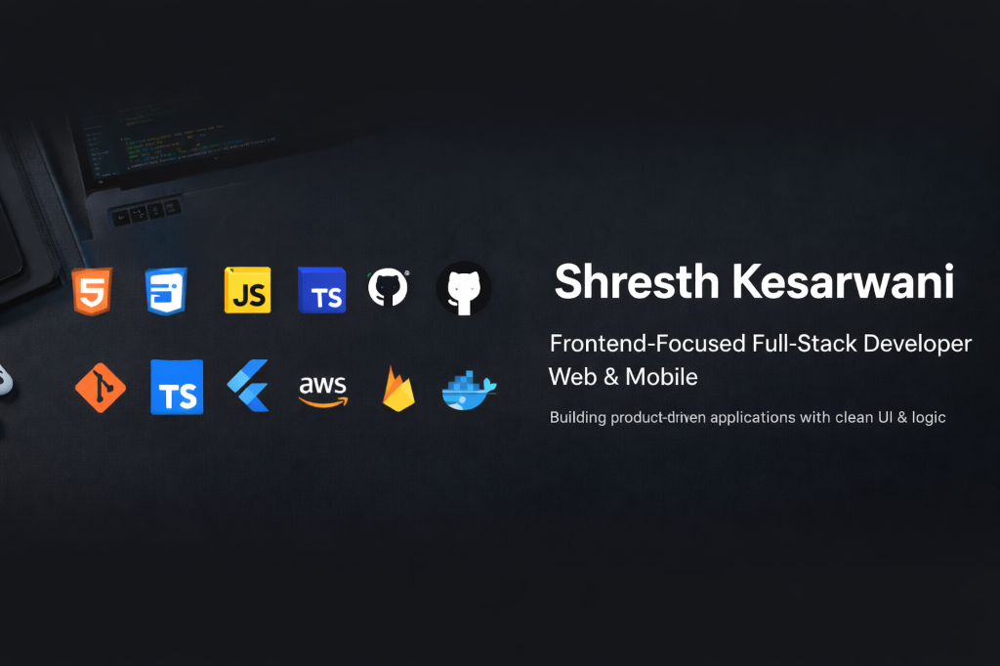

  

<h1 align="center">Hey 👋, I'm <a href="https://github.com/shresth16k" target="_blank">shresth16k</a></h1>

  

  

---

### 👨‍💻 About Me

- 🔭 I’m currently working on **Personal Projects**
- 🌱 I’m currently learning **Advanced Web Development**
- 👯 I’m looking to collaborate on **Open Source Projects**
- 💬 Ask me about **Tech & Coding**
- 📫 How to reach me: **shrestheducation1@gmail.com**

---

### 🛠️ Languages and Tools

  
  
  
  
  
  
  

---

### 📊 GitHub Stats

  

  

  

---
### 🐍 Contribution Graph

  

### 🤝 Connect with Me

  
  <!-- Add more social links below -->

